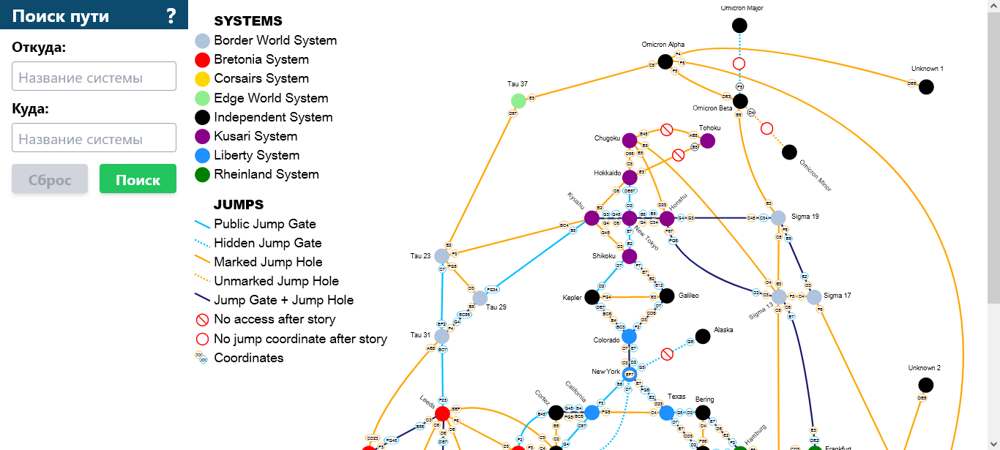
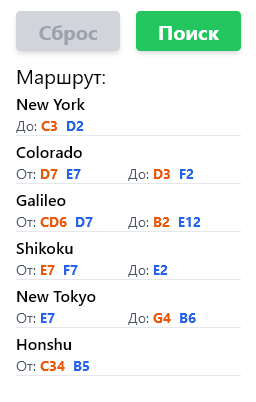

# Навигатор для Freelancer

Это приложение - навигатор по игровой карте. В игре есть 49 планетарных систем, перемещение
между которыми возможно при помощи червоточин двух видов: гиперворот и прыжковых дыр. По сути,
гиперворота - это "благоустроенная" прыжковая дыра.

"Родной" игровой навигатор строит маршруты только через гиперворота и не учитывает прыжковые дыры,
что усложняет игровую логистику. Это приложение строит маршрут между двумя указанными
планетарными системами методом поиска "в ширину", что обеспечивает нахождение кратчайшего маршрута
(с наименьшим количеством прыжков).

Сразу оговорюсь: в проекте много недоработок - сейчас он находится в стадии минимально
жизнеспособного продукта. Тому есть несколько причин, основная из которых - цейтнот. Суммарно,
проект выполнен (примерно) за 32 часа "чистого" времени. Реальное время составило около недели, с учётом того,
что разработка велась в свободное от основной работы время.

## Доработки

На текущий момент можно доработать следующее:

- Переработать структуру исходных данных карты (`src/data.js`), чтобы избежать использования наименований
систем в качестве ключей и упростить получение данных карты "из кода".

- Провести рефакторинг кода для улучшения его читабельности и общей оптимизации.

- Изменить дизайн интерфейса приложения - сделать карту интерактивной, добавить "подсветку" вычисленного
маршрута на карте, добавить возможность указания начальной и конечной точек щелчком по узлу карты,
добавить возможность масштабирования карты.

- Сделать поиск и подсказку ввода в полях "Откуда" и "Куда" нечувствительным к регистру, чтобы упростить взаимодействие
пользователя и приложения.

- Провести расчёт всех возможных маршрутов с целью проверки правильности данных карты: все ли возможные маршруты
могут быть вычислены приложением.

- Добавить возможность указания промежуточных точек в маршруте, чтобы расчёт производился не только от начальной
точки к конечной, но и в более сложных конфигурациях.

- Добавить к картографическим данным сведения о системах: присутствующих там объектах, фракциях и т. д.

- Добавить перечень внутриигровых товаров с ценами и реализовать решение классической задачи коммивояжёра для нахождения оптимальных торговых маршрутов.

- Переработать приложение в формат PWA для упрощения использования на мобильных устройствах.

## Почему JS и React

Используемый стек выбран по следующим причинам:

- Сейчас (для меня) это самый быстрый способ создания универсального пользовательского интерфейса, доступного
на большом количестве устройств и операционных систем.

- Малый набор данных, который можно хранить в статическом виде и отдавать вместе с приложением.

- Нет необходимости в хранении какой-либо пользовательской информации.

## Как этим пользоваться

В настоящее время работающее приложение доступно по адресу <http://zvookiejoo.ru/>. С публикации оно будет снято
не раньше 01.04.2022, когда отпадёт необходимость в его постоянной доступности. Ввиду того, что оно опубликовано на
моём тестовом сервере - возможны временные перерывы в его работе, однако по вашей просьбе доступ к нему может быть
восстановлен.

Тем не менее, приложение можно развернуть самостоятельно, используя Docker: для этого есть соответствующий `Dockerfile`
и `docker-compose.yml`. Для этого достаточно выполнить команду `docker-compose up -d` в директории приложения - подтянутся
необходимые образы, выполнится сборка приложения и запуск веб-сервера с ним.

Главный (и единственный) экран приложения выглядит так:

В полях "Откуда" и "Куда" указываются начальные и конечные точки. Нажатие кнопки "Поиск" запустит вычисление кратчайшего маршрута и выведет результат в виде списка под блоком с кнопками.

**Полужирным** выделены названия систем, через которые пролегает маршрут. Цветом выделены координаты игровой карты планетарной системы, на которых находятся прыжковые ворота/дыры в соответствующие системы. Оранжевые - дыры, синие - ворота. Меткой "До" помечены координаты, в которых находится переход в следующую систему; меткой "От" - место вашего появления в системе.

## Структура проекта

Картографические данные находятся в файле `src/data.js` и представляют собой пары "ключ-значение". Ключом является название планетарной системы, значением - объект, описывающий все присутствующие в системе ворота и дыры. Аналогично: ключи этого объекта являются наименованиями систем, куда ведут ворота/дыра, а его значение - объект (или массив объектов) с тремя полями: положением в системе (`loc`), признаком ворота\дыра (`gate`), признаком скрытия объекта (`hidden`). На карте эти обозначения соответствуют цветам рёбер графа и стилю линий (сплошная - открытый маршрут, пунктирная - скрытый).

Сам поисковый алгоритм реализован в файле `src/core.js`. Там находится
метод `findPath(from, to)`, возвращающий массив наименований систем, входящих в маршрут.
